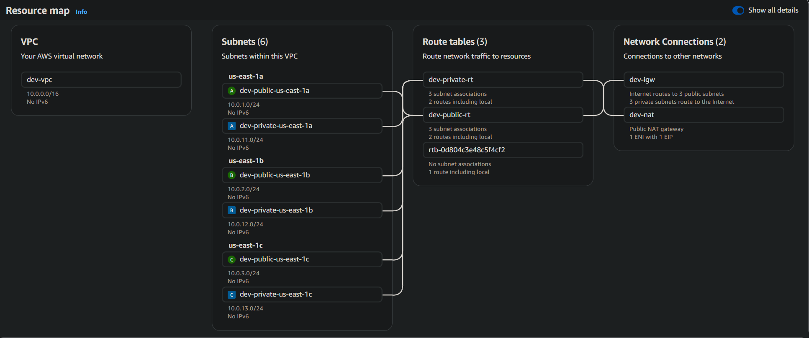

# Creating VPC infrastructure using Terraform modules

This section is the same as the previous one, but now has a module for VPC.

It creates:

- A Custom VPC,
- 3 Private subnets,
- 3 Public subnets,
- 1 Internet Gateway,
- 1 NAT Gateway,
- Elastic IP for NAT Gateway,
- Route tables and its associations.

