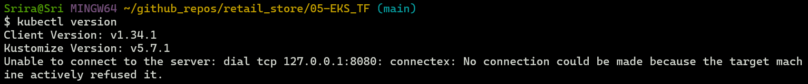
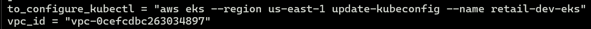
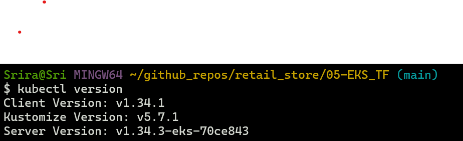

# Creating EKS Cluster 

This section will be used to create an EKS cluster. 
Ensure that S3 is configured as backend and the underlying VPC architecture is already provisioned before creating EKS cluster.

## Steps to Provision manually

```bash
# Terraform Initialize
terraform init

# Terraform Validate
terraform validate

# Terraform Plan
terraform plan

# Terraform Apply
terraform apply
```

## Use shell script

Alternatively, execute create-cluster.sh script to create VPC and EKS cluster.

## Configure kubectl cli to access EKS cluster





```bash
# EKS kubeconfig
aws eks update-kubeconfig --name <cluster_name> --region <aws_region>
```


```bash
# List Kubernetes Nodes
kubectl get nodes

# List Kubernetes Pods 
kubectl get pods -n kube-system
```
