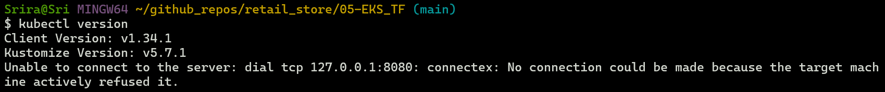

# Creating EKS Cluster 

This section will be used to create an EKS cluster. 
Ensure that S3 is configured as backend and the underlying VPC architecture is already provisioned before creating EKS cluster.

### Steps to Provision manually

```bash
# Terraform Initialize
terraform init

# Terraform Validate
terraform validate

# Terraform Plan
terraform plan

# Terraform Apply
terraform apply
```

## Use shell script

Alternatively, execute scripts/create-cluster.sh script to create VPC and EKS cluster.

Use [create_cluster](scripts/create_cluster.sh) script to provision them if they have not been provisioned already. 

If you run into "Error locating Chart" error, update the helm repo.


## Configure kubectl cli to access EKS cluster

After the EKS Cluster is created, get the "to_configure_kubectl" value from the output. This gives the command which should enable you to connect to your cluster.




```bash
# EKS kubeconfig
aws eks update-kubeconfig --name <cluster_name> --region <aws_region>
```


```bash
# List Kubernetes Nodes
kubectl get nodes

# List Kubernetes Pods 
kubectl get pods -n kube-system
```

# Installing EKS Cluster AddOns using Terraform on EKS Cluster

## Following Addons will be added to the EKS Cluster with Terraform:

* AWS Load Balancer Controller (LBC) - automatically provisions and manages Load Balancers (ALB/NLB) when Kubernetes resources such as Ingress and LoadBalancer Service are defined. Refer tf files 13_01 till 13_04.
* Amazon EBS CSI Driver - dynamically provisions Amazon EBS volumes for StatefulSets. Refer tf files 14_01 till 14_03.
* Secrets Store CSI Driver (with ASCP) - mounts AWS Secrets Manager / SSM Parameter Store secrets directly into Pods (with ASCP). Refer tf files 15_01 and 15_02.
* EKS Pod Identity Agent - allows Pods to assume IAM Roles (for secure access to AWS Services). By using IAM Roles, services can be accessed securely without storing credentials locally. Refer tf files 12_01 and 12_02.

## Execution Flow:

* Create VPC Infrastructure (refer Section-04) and EKS Infrastructure using Terraform. Use create_cluster.sh script in scripts folder to create VPC and EKS. 
* Install Addons to EKS.
