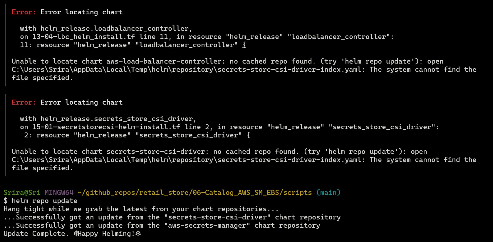

# Implement Catalog Microservice using AWS Secret Manager and EBS Persistence Storage

Catalog microservice:

- contains a deployment that manages the application pods,
- contains a statefulset that manages the DB pods,
- uses AWS Secret Manager to manage secrets,
- uses EBS for persistent storage. 

Objective: 

- Secrets for Catalog microservice will not be stored in EKS etcd. Secrets will be obtained from AWS Secret Manager and will be loaded as Volumes to pods using Secrets Store CSI Driver and ASCP. This is to mitigate risk in case EKS is compromised.
- Catalog DB storage will use EBS using EBS CSI Driver.

## Pre-requisite: VPC and EKS 

Ensure that VPC and EKS are already provisioned.

- Use [create_cluster](scripts/00-create_cluster.sh) script to provision them if they have not been provisioned already. 
- If you run into "Error locating Chart" error, update the helm repo.



- After the provisioning, note down the values from Outputs. Run the command from to_configure_kubectl output to make sure cli is connected to EKS cluster. 


## Create EKS Pod Identity Agent, Install Secrets Store CSI Driver and ASCP using Helm

### Step for execution:

#### Step 1: Create EKS Pod Identity Agent

Pod Identity Agent is deployed as a daemonset. It will run on every node and provide pods running in those nodes with the access they need.

Run [Install Pod Identity Agent script](scripts/01-install_pod_identity_agent.sh) to create Pod Identity Agent addon for the EKS Cluster. 

Alternatively, if you wish to do this manually:

* Go to AWS Console -> EKS -> Clusters -> Get Add ons -> Locate Pod Identity Agent plugin -> choose and leave default options -> click on Create.

* Use kubectl get ds -n kube-system command to verify the agent was installed.

#### Step 2: Install Helm locally and add helm repos for CSI Driver and AWS Provider plugin ASCP

[Ensure that Helm CLI is installed.](https://helm.sh/docs/intro/install/)

Run [Helm script to add the repos and to update them](scripts/02-helm.sh).

Workflow: Pod -> Secrets Store CSI Driver -> AWS Provider Plugin (ASCP) -> AWS Secrets Manager.

Secrets Store CSI Driver - Kubernetes driver that allows pods to mount secrets from external secret stores as volumes.

AWS Secrets and Configuration Provider (ASCP): AWS provider plugin for the CSI driver. CSI driver itself doesn't know how to talk to secret systems.  It needs a provider plugin so that it can fetch secrets from AWS Secrets Manager.

#### Step 3: Install the Secrets Store CSI Driver and ASCP using Helm in EKS kube-system namespace 

Run [Script to install CSI driver and ASCP to kube-system namespace in EKS Cluster](scripts/03-install_csi_driver_and_ascp.sh).

#### Step 4: Create IAM Role, Policy and EKS Pod Identity Association

Now that Drivers are installed, IAM resources need to be created so that Pods can assume AWS Role using Pod Identity.

Run [IAM bash script](scripts/04-iam_role_and_policies_for_catalog.sh). This creates all necessary resources for **Catalog microservice only**.

#### Step 5: Create Pod Identity Association

Run [Create Pod Identity Association script](scripts/05-create_pod_identity_association.sh). 

#### Step 6: Install Amazon EBS CSI Driver on EKS with Pod Identity

The Amazon EBS CSI Driver integrates Kubernetes with Amazon Elastic Block Store so that workloads can request storage using Kubernetes objects like PersistentVolumeClaims (PVCs).

*Workflow:*

A pod requests storage via a PVC -> Kubernetes calls the EBS CSI driver -> The driver calls AWS APIs -> A new EBS volume is created and attached to the node.

Objectives:

- Create a trust policy file for the EBS CSI Driver IAM Role.
- Create an IAM Role (AmazonEKS_EBS_CSI_DriverRole_retail-dev-eks) and attach the AmazonEBSCSIDriverPolicy managed policy. AmazonEBSCSIDriverPolicy: AWS IAM managed policy that grants the permissions needed for the Amazon EBS CSI driver to manage Amazon EBS volumes on behalf of Kubernetes clusters.
- Create a Pod Identity Association for the EBS CSI controller ServiceAccount.
- Install the Amazon EBS CSI Driver add-on (aws-ebs-csi-driver) using AWS CLI.
- Verify installation using kubectl.

Run the [EBS CSI Driver script](scripts/06-Install_EBS_CSI_driver.sh).

```bash

List of Roles and Policies that should be available by this step: 

For secrets:

catalog-db-secret-policy
catalog-db-secrets-role

For EBS:

AmazonEBSCSIDriverPolicy (Managed policy. Not customer created)
AmazonEKS_EBS_CSI_DriverRole_retail-dev-eks

Addons installed:
{
    "addons": [
        "aws-ebs-csi-driver",
        "eks-pod-identity-agent"
    ]
}
```

#### Step 7: Connect AWS Secrets Manager with Kubernetes Pods 

We will securely connect AWS Secrets Manager with Catalog microservice pods so that credentials to MySQL DB can be shared. In this zero-trust setup, credentials are not stored in Kubernetes Secrets and are fetched dynamically via ASCP.

Run [Connect_AWS_SM_and_Catalog script](scripts/06-Connect_AWS_SM_and_Catalog.sh). 

- Create the secret (catalog-db-secret-1) with MySQL credentials in AWS Secret Manager, 
- Define a SecretProviderClass that retrieves this secret using EKS Pod Identity,
- Update both the MySQL StatefulSet and Catalog Deployment to mount and use these secrets,
- Retrieve Secret from AWS Secret Manager without storing Kubernetes Secrets in etcd minimizing risk of exposing secrets if the cluster is ever compromised.

#### Step 8: Connect to MySQL Database and Verify

Create a Pod and use it as a client to connect to MySQL DB

Option 1: Let MySQL prompt you

Run a Pod:

```bash
kubectl run mysql-client \
  --rm -it \
  --restart=Never \
  --image=mysql:8.0 \
  -- bash
```

When inside the pod:

```bash
  mysql -h catalog-mysql -u mydbadmin -p
```
Provide the password as mysqldb101. [Refer](catalog_k8s_manifests/03-catalog_configmap.yaml).

Option 2: Use Environment variable

```bash
kubectl run mysql-client --rm -it \
  --image=mysql:8.0 \
  --restart=Never \
  --env MYSQL_PWD=mysqldb101 \
  -- mysql -h catalog-mysql -u mydbadmin
```

Run SQL Commands

```
SHOW DATABASES;
USE catalogdb;
SHOW TABLES;
SELECT COUNT(*) FROM products;
SELECT * FROM products;
SELECT * FROM tags;
SELECT * FROM product_tags;
EXIT;
```

#### Step 9: Cleanup

Run [Cleanup script](scripts/08-cleanup_catalog.sh). 

Remember that even after Catalog resources are cleaned up, EBS volume remains until PVC is deleted. 

```bash
kubectl get pvc
kubectl get pv
```

Output:
```bash
$ kubectl get pvc
NAME                       STATUS   VOLUME                                     CAPACITY   ACCESS MODES   STORAGECLASS   VOLUMEATTRIBUTESCLASS   AGE
data-ebs-catalog-mysql-0   Bound    pvc-ac9d31d2-df43-4e65-9f03-80378fb2aa43   10Gi       RWO            ebs-sc         <unset>                 29m

$ kubectl get pv
NAME                                       CAPACITY   ACCESS MODES   RECLAIM POLICY   STATUS   CLAIM                              STORAGECLASS   VOLUMEATTRIBUTESCLASS   REASON   AGE
pvc-ac9d31d2-df43-4e65-9f03-80378fb2aa43   10Gi       RWO            Delete           Bound    default/data-ebs-catalog-mysql-0   ebs-sc         <unset>                          29m
```

Delete PVC manually:

```bash
kubectl delete pvc data-ebs-catalog-mysql-0 
```
Verify using AWS CLI:

```bash
aws ec2 describe-volumes \
  --filters "Name=size,Values=10" \
  --query "Volumes[*].{ID:VolumeId,State:State,Size:Size}" \
  --output table
  ```

Run [Destroy Cluster script](scripts/09-destroy_cluster.sh) to destroy EKS and VPC.

