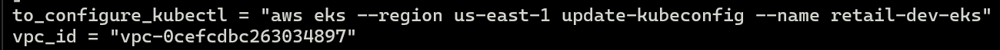
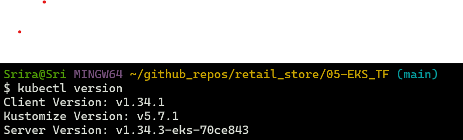

# Implement Catalog Microservice using AWS Secret Manager and RDS

Catalog microservice:

- contains a deployment that manages the application pods,
- contains a statefulset that manages the DB pods,
- uses AWS Secret Manager to manage secrets,
- uses RDS for MySQL DB. 

Objective: 

- Secrets for Catalog microservice will not be stored in EKS etcd. Secrets will be obtained from AWS Secret Manager and will be loaded as Volumes to pods using Secrets Store CSI Driver and ASCP. This is to mitigate risk in case EKS is compromised.
- Catalog DB storage will use RDS MySQL DB. Provisiniong in this section will be manual. All steps listed will be for manual provisioning.

## Pre-requisite: VPC and EKS 

Ensure that VPC and EKS are already provisioned.

- Use [create_cluster](scripts/00-create_cluster.sh) script to provision them if they have not been provisioned already. 
- After the provisioning, note down the values from Outputs. Run the command from to_configure_kubectl output to make sure cli is connected to EKS cluster. 

.

.

## Create EKS Pod Identity Agent, Install Secrets Store CSI Driver and ASCP using Helm

### Step for execution:

#### Step 1: Create EKS Pod Identity Agent

Pod Identity Agent is deployed as a daemonset. It will run on every node and provide pods running in those nodes with the access they need.

Run [Install Pod Identity Agent script](scripts/01-install_pod_identity_agent.sh) to create Pod Identity Agent addon for the EKS Cluster. 

Alternatively, if you wish to do this manually:

* Go to AWS Console -> EKS -> Clusters -> Get Add ons -> Locate Pod Identity Agent plugin -> choose and leave default options -> click on Create.

* Use kubectl get ds -n kube-system command to verify the agent was installed.

---

#### Step 2: Install Helm locally and add helm repos for CSI Driver and AWS Provider plugin ASCP

[Ensure that Helm CLI is installed.](https://helm.sh/docs/intro/install/)

Run [Helm script to add the repos and to update them](scripts/02-helm.sh).

Workflow: Pod -> Secrets Store CSI Driver -> AWS Provider Plugin (ASCP) -> AWS Secrets Manager.

Secrets Store CSI Driver - Kubernetes driver that allows pods to mount secrets from external secret stores as volumes.

AWS Secrets and Configuration Provider (ASCP): AWS provider plugin for the CSI driver. CSI driver itself doesn't know how to talk to secret systems.  It needs a provider plugin so that it can fetch secrets from AWS Secrets Manager.

---
#### Step 3: Install the Secrets Store CSI Driver and ASCP using Helm in EKS kube-system namespace 

Run [Script to install CSI driver and ASCP to kube-system namespace in EKS Cluster](scripts/03-install_csi_driver_and_ascp.sh).

---
#### Step 4: Create IAM Role, Policy and EKS Pod Identity Association

Now that Drivers are installed, IAM resources need to be created so that Pods can assume AWS Role using Pod Identity.

Run [IAM bash script](scripts/04-iam_role_and_policies_for_catalog.sh). This creates all necessary resources for **Catalog microservice only**.

---
#### Step 5: Create Pod Identity Association

Run [Create Pod Identity Association script](scripts/05-create_pod_identity_association.sh). 

---
## Create Amazon RDS Database (using AWS Console)

### Step 1: Create VPC Security Group (for RDS)

This Security Group will allow the RDS database to accept traffic only from EKS cluster.

#### Get the EKS Cluster Security Group

Run the following command to find EKS Cluster Security Group ID, which will then be used as the source for RDS inbound rules:

```bash
aws eks describe-cluster \
  --name retail-dev-eks \
  --query "cluster.resourcesVpcConfig.clusterSecurityGroupId" \
  --output text
```

Example output:

```
sg-0261715a69b39dbc5
```

---
### Step 2: Create RDS Security Group

* **Console:** EC2 → Security Groups → Create security group
* **Name:** `rds-mysql-sg`
* **VPC:** *Select the same VPC as your EKS cluster*
* **Inbound rules:**
    * **Type:** MySQL/Aurora (3306)
    * **Protocol:** TCP
    * **Source:** *EKS Cluster Security Group ID* (e.g., `sg-0261715a69b39dbc5`)

* Click on **Create security group**.

---
### Step 3: Create DB Subnet Group (private subnets)
- **Console:** RDS → Subnet groups → **Create DB subnet group**
- **Name:** `rds-private-subnets`
- **VPC:** *Select the EKS VPC*
- **Subnets:** Add **private subnets** 
- **Create**

---
### Step 4: Create the RDS MySQL Instance
- **Console:** RDS → Databases → **Create database**
- **Method:** Full config option (not easy create)
- **Engine:** **MySQL** (8.0)
- **Templates:** Free tier or Dev/Test
- **DB instance identifier:** `mydb3`
- **Master username:** `mydbadmin`
- **Master password:** `mysqldb101`
- **Instance class:** `db.t3.micro`
- **Storage:** (default is fine)
- **Connectivity:**
  - **VPC:** *EKS VPC*
  - **DB Subnet group:** `rds-private-subnets`
  - **Public access:** **No**
  - **VPC security group:** **Choose existing** → `rds-mysql-sg`
- (Optional) Disable **Delete protection** for easy cleanup
- **Create database**

---
### Step 5: Connect to RDS and Create Database Schema

Once the database is available, connect to the RDS instance from within your EKS cluster using a temporary MySQL client pod.

We will let MySQL prompt for a password.

```bash
kubectl run mysql-client \
  --rm -it \
  --restart=Never \
  --image=mysql:8.0 \
  -- bash
````

When inside the pod, issue the command:

```
mysql -h mydb101.c4fcawcuw766.us-east-1.rds.amazonaws.com -u mydbadmin -p
```

Note: Replace the hostname information with the endpoint information of your RDS DB.

When prompted, enter the password:

```
mysqldb101
```

Inside the MySQL shell, create the `catalogdb` schema:

```sql
CREATE DATABASE catalogdb;
SHOW DATABASES;
EXIT;
```

---

### Step 6: Apply Kubernetes Manifests

Compared to Section 06, we will use an **ExternalName Service** that points to the RDS endpoint.

### catalog_k8s_manifests

`05_catalog_mysql_externalname_service.yaml`  
   - Update with your **AWS RDS Endpoint**:

```yaml
apiVersion: v1
kind: Service
metadata:
  name: catalog-mysql
spec:
  type: ExternalName
  externalName: mydb101.c4fcawcuw766.us-east-1.rds.amazonaws.com # paste your mysql db endpoint here
  ports:
    - port: 3306
```

--- 

### Step 7: Deploy Resources

Deploy in the following order:

```bash
# Deploy Secret Provider Class
kubectl apply -f secretproviderclass/

# Deploy Catalog Application
kubectl apply -f catalog_k8s_manifests/
```

---

### Step 8: Verify Setup

Verify Catalog Application Logs
```bash
# Verify Logs
kubectl logs -f deploy/catalog
```

Verify Application

Run a test pod inside the same namespace:

```bash
kubectl run test --image=curlimages/curl -it --rm -- sh
```

Inside the pod:

```
curl http://catalog-service:8080/topology
```

Use curl:

```
# Catalog Endpoints
http://catalog-service:8080/health
http://catalog-service:8080/catalog/topology
http://catalog-service:8080/catalog/products
http://catalog-service:8080/catalog/tags
http://catalog-service:8080/catalog/size
```

You should see successful responses indicating connectivity to RDS.

---

Verify Database Entries in RDS

Now that the Catalog microservice is running and connected to RDS, log in to the RDS database from within the EKS cluster to verify data persistence.

---

Launch a temporary MySQL client Pod inside EKS


Let MySQL prompt you

```bash

kubectl run mysql-client \
  --rm -it \
  --restart=Never \
  --image=mysql:8.0 \
  -- bash

````

When inside the pod, issue the command:

```
mysql -h mydb101.c4fcawcuw766.us-east-1.rds.amazonaws.com -u mydbadmin -p
```

When prompted, enter the password:

```
mysqldb101
```

---

Run SQL commands inside MySQL shell

Once you enter the password and connect successfully, run:

```sql
USE catalogdb;
SHOW TABLES;
SELECT * FROM products;
EXIT;
```

---


### Step 9: Cleanup

Remove Kubernetes Resources

```bash
# Delete Secret Provider Class
kubectl delete -f 01_secretproviderclass/

# Delete Catalog Application
kubectl delete -f 02_catalog_k8s_manifests
```

Step-07-02: Delete RDS Instance
1. From the AWS Console → **RDS → Databases** → Delete.
2. From the AWS Console → **RDS → Subnet groups → rds-private-subnets** → Delete.
3. From the AWS Console → **EC2 → Security groups → Delete rds-mysql-sg security group**.

---

