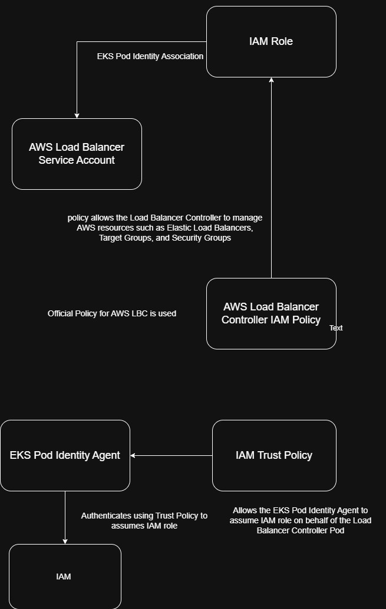
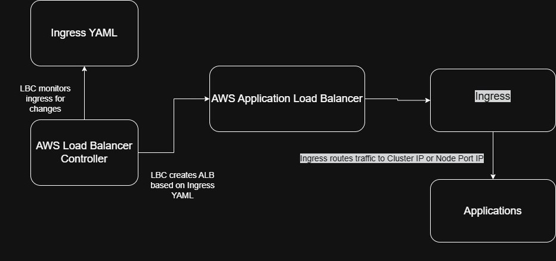

# Implement Ingress in EKS using Amazon Load Balancer Controller (with Pod Identity)

Steps:

* Create a Trust policy file for Load Balancer Controller IAM Role.
* Create and attach AWSLoadBalancerControllerIAMPolicy to IAM Role.
* Create an EKS Pod Identity Association between the IAM Role and AWS LBC ServiceAccount.
* Install the AWS Load Balancer Controller using Helm.

How IAM Policies and IAM Role are connected:

LBC Workflow:

